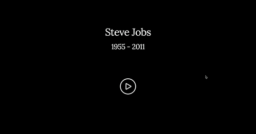

# tribute-page
A Steve Jobs tribute page as a [Free Code Camp](https://www.freecodecamp.com/challenges/build-a-tribute-page) front-end project where I show some information about the Apple creator life. Made using [HTML5], [CSS3] for code, and [Photoshop](http://www.adobe.com/es/products/photoshop.html) for design.

## Built with
- [HTML5](https://developer.mozilla.org/es/docs/HTML/HTML5)
- [CSS3](https://developer.mozilla.org/es/docs/Web/CSS/CSS3)
- [Skeleton](http://getskeleton.com/)
- [Photoshop](http://www.adobe.com/es/products/photoshop.html)
- [Github Pages](https://pages.github.com/)
